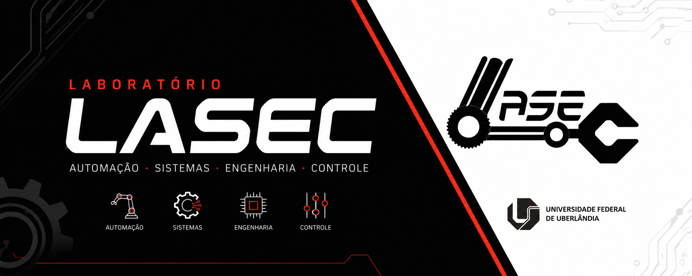

## Laboratório de Automação, Sistemas Eletrônicos e Controle da Universidade Federal de Uberlândia - LASEC/UFU

## 📌 Sobre o LASEC

O LASEC (Laboratório de Automação, Sistemas Eletrônicos e Controle) é um laboratório vinculado à Universidade Federal de Uberlândia (UFU), dedicado ao desenvolvimento de projetos, pesquisas e aplicações nas áreas de automação, sistemas embarcados, robótica, controle e tecnologias inteligentes.

O laboratório busca integrar ensino, pesquisa e extensão por meio do desenvolvimento de soluções tecnológicas, projetos acadêmicos e iniciativas voltadas à inovação, promovendo a formação prática e científica de estudantes e pesquisadores.

## 🌐 Sobre este perfil

Este perfil reúne os projetos, pesquisas e iniciativas desenvolvidos pelo LASEC, abrangendo aplicações tecnológicas, produção acadêmica e atividades voltadas à inovação e experimentação científica.

Aqui são compartilhados códigos-fonte, documentações, artigos, protótipos e materiais relacionados às atividades do laboratório, incentivando colaboração, aprendizado e disseminação do conhecimento científico e tecnológico.

## 📫 Contato

  📧 Email: lasecca@gmail.com  
  🎓 Universidade Federal de Uberlândia (UFU)  
  📍 Uberlândia - MG, Brasil

